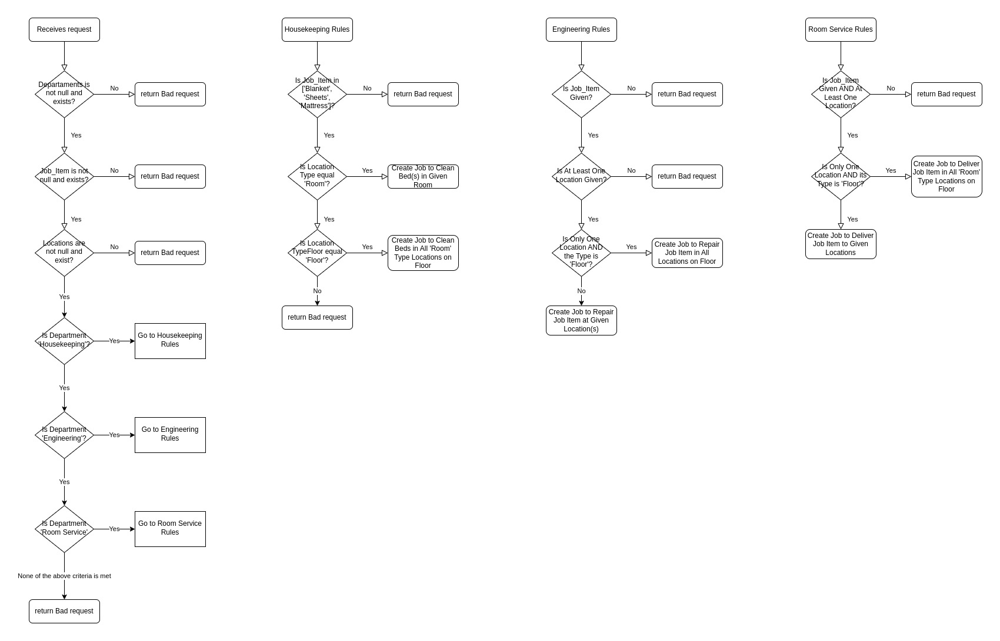

# Job Rule Engine

Mini rule engine to create jobs based on a set of rules.

## Flowchart



## Development

### Requirements

- Docker
- Docker-Compose
- (Optional) VS Code with Remote Containers extension

### How to run

#### Using VS Code

1. Open the project in VS Code
2. Install the Remote Containers extension
3. Click on the button in the bottom left corner.
4. Select `Remote Containers: Reopen in Container`

#### Using Docker Compose

1. Run `docker-compose -f .devcontainer/docker-compose.yml up -d`

To enter inside of the container run:

```bash
docker-compose -f .devcontainer/docker-compose.yml exec engine bash
```

#### How it works

It creates and run the containers with all dependencies installed. You can develop in the IDE of your choice and the code will be synced with the container.

#### How to run tests

If you are using VS Code, you can run the tests using the opening a terminal inside the container and running `go test ./...`.

If you are using Docker Compose, you can run the tests using `docker-compose -f .devcontainer/docker-compose.yml exec engine go test ./...`.

## Production

To simulate the production environment, run `make run` and will spin up the container and run the application.

The `Dockerfile` is already configured to build the application for production environment and run it.
